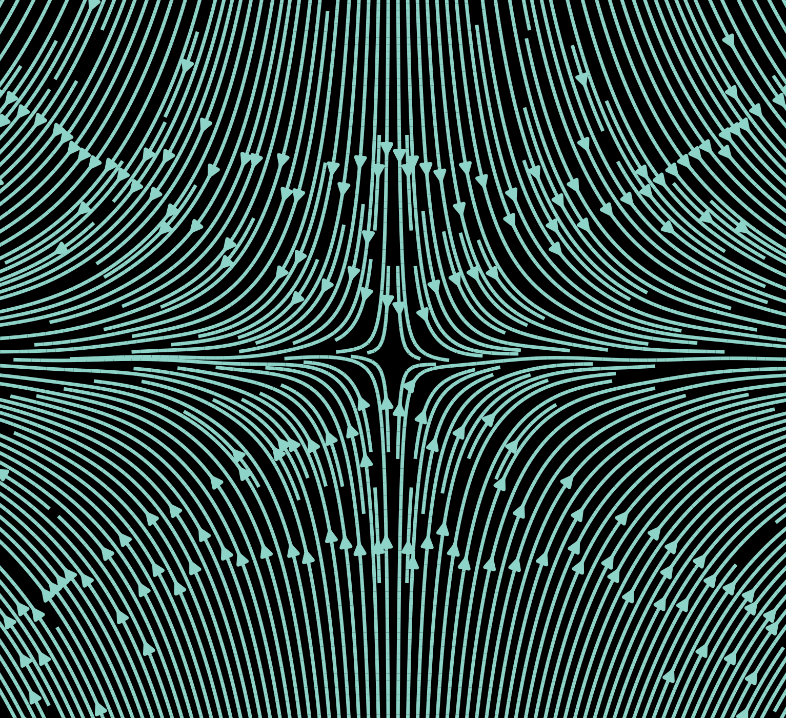

# Vector field image generator 

Script that generates a PNG file with desired vector field. 

## Usage 

``` 

usage: Save vector fields as a PNG file. Comes with several default vector fields.
       [-h]
       [-c {Solarize_Light2,_classic_test_patch,bmh,classic,dark_background,fast,fivethirtyeight,ggplot,grayscale,seaborn,seaborn-bright,seaborn-colorblind,seaborn-dark,seaborn-dark-palette,seaborn-darkgrid,seaborn-deep,seaborn-muted,seaborn-notebook,seaborn-paper,seaborn-pastel,seaborn-poster,seaborn-talk,seaborn-ticks,seaborn-white,seaborn-whitegrid,tableau-colorblind10}]
       [-v VECTORFIELD] [-ht HEIGHT] [-w WIDTH] [-d DENSITY] [-p PATH]
       [-f FUNCTION FUNCTION] [-s]

optional arguments:
  -h, --help            show this help message and exit
  -c {Solarize_Light2,_classic_test_patch,bmh,classic,dark_background,fast,fivethirtyeight,ggplot,grayscale,seaborn,seaborn-bright,seaborn-colorblind,seaborn-dark,seaborn-dark-palette,seaborn-darkgrid,seaborn-deep,seaborn-muted,seaborn-notebook,seaborn-paper,seaborn-pastel,seaborn-poster,seaborn-talk,seaborn-ticks,seaborn-white,seaborn-whitegrid,tableau-colorblind10}, --color {Solarize_Light2,_classic_test_patch,bmh,classic,dark_background,fast,fivethirtyeight,ggplot,grayscale,seaborn,seaborn-bright,seaborn-colorblind,seaborn-dark,seaborn-dark-palette,seaborn-darkgrid,seaborn-deep,seaborn-muted,seaborn-notebook,seaborn-paper,seaborn-pastel,seaborn-poster,seaborn-talk,seaborn-ticks,seaborn-white,seaborn-whitegrid,tableau-colorblind10}
                        Color scheme
  -v VECTORFIELD, --vectorfield VECTORFIELD
                        Create a random vector field or use some predefined
                        ones.
  -ht HEIGHT, --height HEIGHT
                        Height. Default:1600
  -w WIDTH, --width WIDTH
                        Width. Default: 900
  -d DENSITY, --density DENSITY
                        Density of the vector field.
  -p PATH, --path PATH  Path in which the file will be saved.
  -f FUNCTION FUNCTION, --function FUNCTION FUNCTION
                        Function to be represented. Two functions must be
                        provided, each for one axis.
  -s, --show            Show the image or not.
```

## Samples


{:height="60%" width="60%"}
{:height="60%" width="60%"}
{:height="60%" width="60%"}
